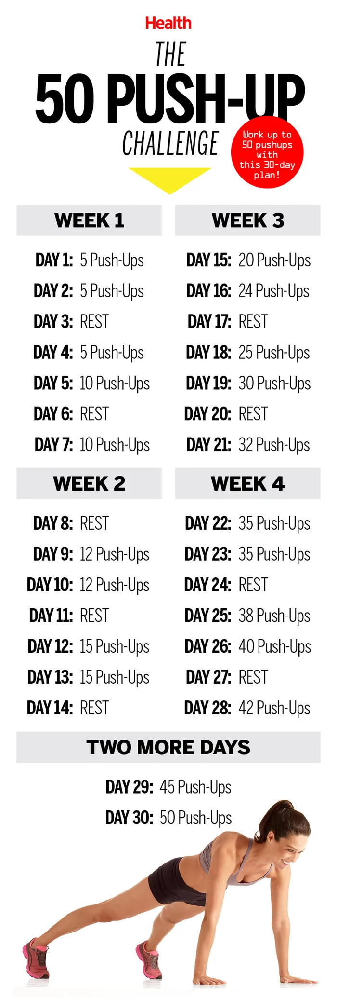

Why GCSA?
=========

I found that picture "The 50 push-ups in a month challenge" back in 2017 and decided it was time to try it.

I wanted a calendar reminder of how many push-ups I need to do every day. As a developer, I couldn't afford
to spend *10 minutes* putting the events manually. So I spent *3 hours* getting the official API to work to do this
for me. Then I thought that this simple task shouldn't take *3 hours* and have spent the next *couple of days*
implementing the initial version of the gcsa. Several years later, I'm happy that people find this project useful.

If you'd like to try this yourself, here's the code you need:

.. code-block:: python

    from gcsa.google_calendar import GoogleCalendar
    from gcsa.event import Event
    from beautiful_date import D, drange, days, MO

    gc = GoogleCalendar()

    PUSH_UPS_COUNT = [
        5, 5, 0, 5, 10, 0, 10,
        0, 12, 12, 0, 15, 15, 0,
        20, 24, 0, 25, 30, 0, 32,
        35, 35, 0, 38, 40, 0, 42,
        45, 50
    ]

    # starting next Monday (of course)
    # +1 days for the case that today is Monday
    start = D.today()[9:00] + 1 * days + MO
    end = start + len(PUSH_UPS_COUNT) * days

    for day, push_ups in zip(drange(start, end), PUSH_UPS_COUNT):
        e = Event(
            f'{push_ups} Push-Ups' if push_ups else 'Rest',
            start=day,
            minutes_before_popup_reminder=5
        )
        gc.add_event(e)

Needless to say, I can't do 50 push-ups.

Let me know in Discord_ if you've tried it.

.. _Discord: https://discord.gg/mRAegbwYKS
